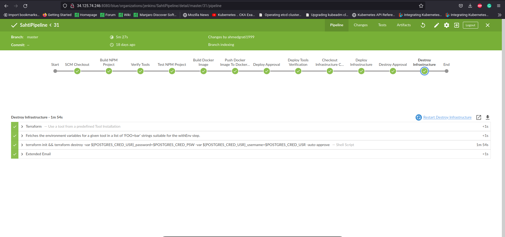
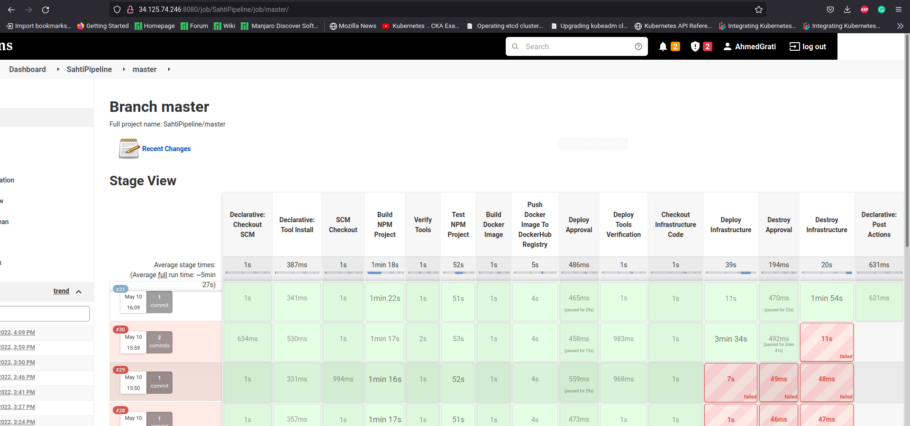
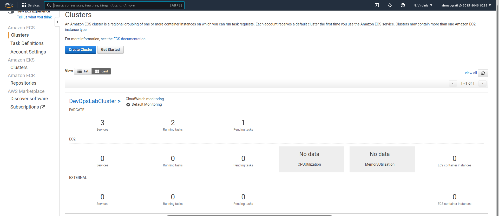
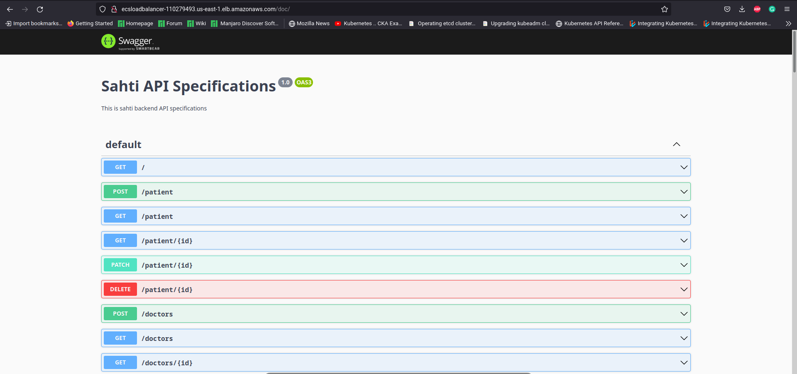

# DevOps Lab
## Pipeline Overview
It is about a CI/CD pipeline built using Jenkins, Docker, AWS, Terraform.
The Jenkins application was hosted on Google Cloud Platform(GCP) Virtual Machine.

Many Plugins were installed into Jenkins like NodeJS Executor, Docker, Terraform, AWS, BlueOcean, any many other plugins.

For terraform code: [click on this link](#https://github.com/AhmedGrati/sahti-iac)
### Continuous Integration
1- Checkout for the specific project

2- Build the NPM project

3- Execute Unit & Integration Tests

### Continuous Deployment
1- Build Docker Image and push it to dockerhub

2- Checkout to Terraform Code

3- Apply our ECS cluster using Terraform

## Execution
### ECS Cluster

### Application
Access Application through Application Load Balancer of AWS

