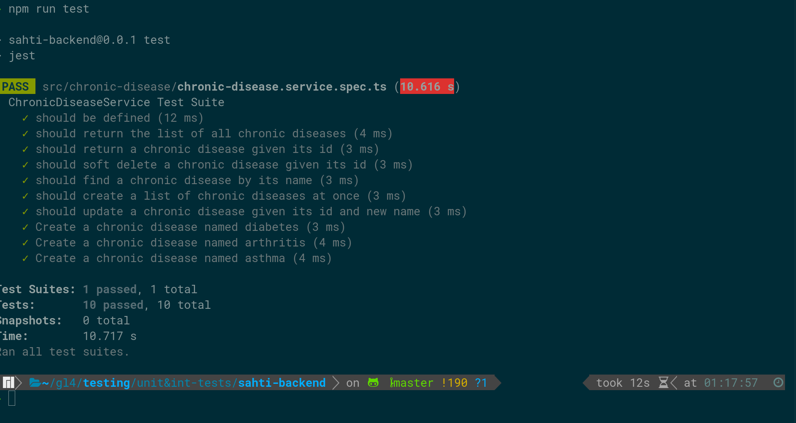
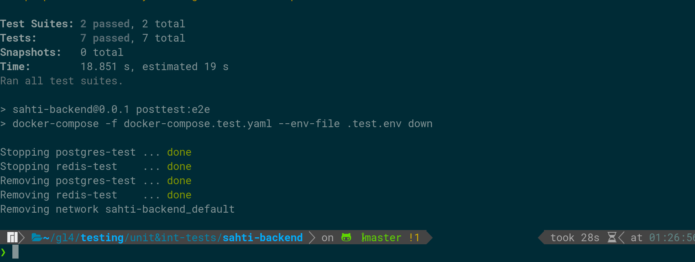

# Sahti

Sahti is a website which aims to organize the tunisian sanitary domain by providing the necessary functionalities for all tiers (Patients, Doctors, Technicians,
Pharmacists
etc...)

## Tech Stack

<div style="width:80%; margin:0 auto;">
  

  
  
  
  
</div>

## Environment Variables

***Environment Variables are not required if you want only to run unit tests.***

To run this project, create `.env` file, copy the `.example.env` file into your `.env` file, and change the following value of the following variable to the appropriate one.

`JWT_VERIFICATION_TOKEN_SECRET`

`JWT_LOGIN_TOKEN_SECRET`

`JWT_RESET_TOKEN_SECRET`

`MAIL_PASSWORD`

## Run Unit Tests

For the moment, unit tests are made only for `chronic-disease` module, and they are located in the file `src/chronic-disease/chronic-disease.service.spec.ts`

To run unit tests, run the following command:

```bash
npm run test
```
You should see the following result:


## Run Integration Tests
### 1- Prerequisite
You should have docker installed on your host machine to run integration tests, because at the moment of testing, I will run a clean postgres and redis databases using docker-compose.

**Note that you should have ports 5431 and 6379 available for databases on your host machine.**
### 2- Running Tests

Before running the integration tests, I will run 2 docker container without any volumes attached, so that data would not persisted between tests and for every new running tests it will have a new clean database.
After running the integration tests, The docker containers will be removed.

Form more details, You could check the `pretest:e2e` and `posttest:e2e` in the `package.json` file.

For the moment, integration tests are made only for `chronic-disease` module, and they are located in the file `test/chronic-disease.e2e-spec.ts`.
To run integration tests, run the following command:

```bash
npm run test:e2e
```
You should see the following result:


**Note that you would probably encounter some error logs before seeing the result of tests, It is okay because it does not have an influence on the tests process. These are internal errors of Jest, not related to the actual tests.**

## Run Locally

1- Make sure you have docker and docker-compose installed in your system by running these commands:

```bash
docker --version
docker-compose --version
```

2- Clone the project

```bash
  git clone https://github.com/AhmedGrati/sahti-backend
```

3- Go to the project directory

```bash
  cd sahti-backend
```

4- Run the project

```bash
  docker-compose up
```

## License

The source code for the site is licensed under the [MIT](https://choosealicense.com/licenses/mit/) license, which you can find in the LICENSE.txt file.
